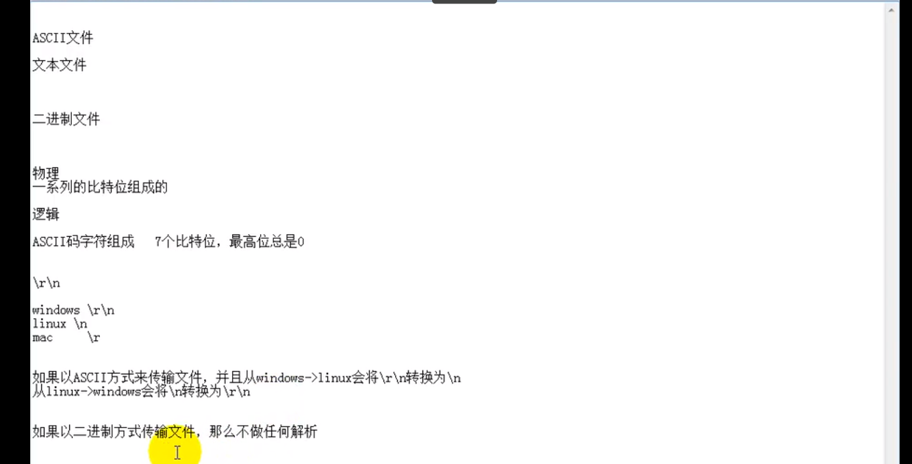
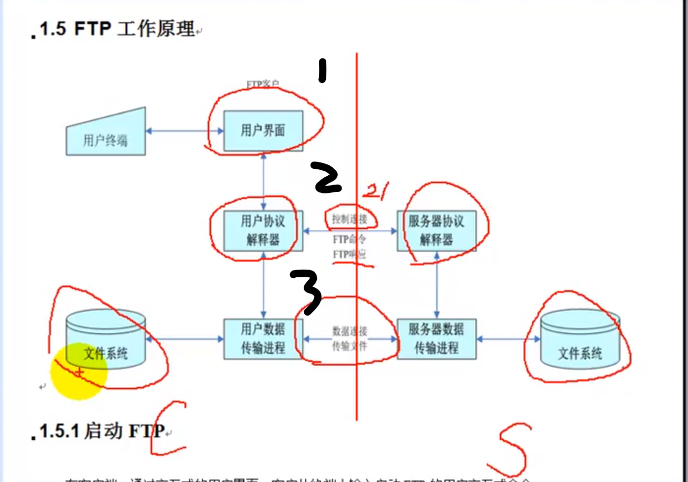
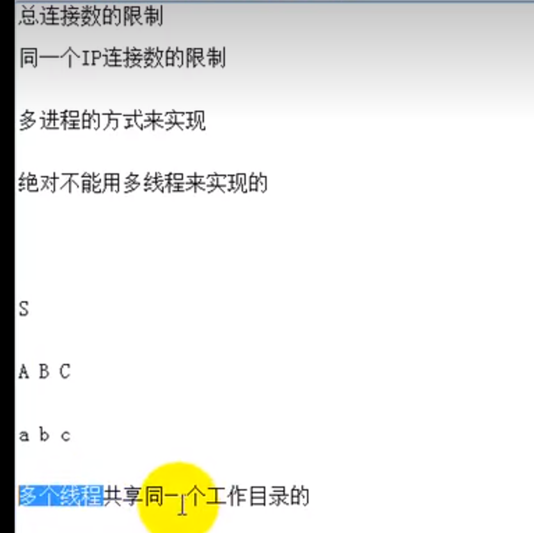
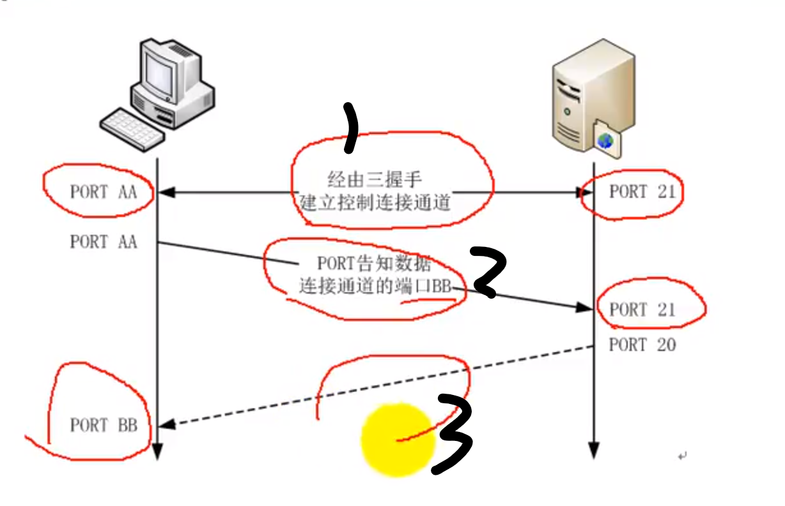
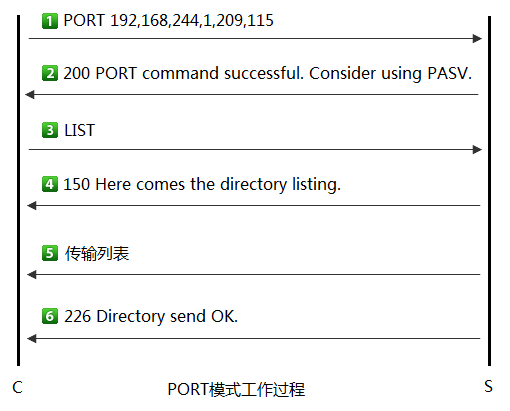

# 面试资料

# 通过设置不同响应码来返回系统状态
# FTP两种工作模式
## 主动模式（PORT模式)：服务器端主动连接客户端

## 被动模式：客户端主动连接服务器端

# sysutil.c
## 20==>struct hostent *hp;

# session.c
## 6==>socketpair();

## 8==>getpwnam();

# ftpproto.c
## 6==>writen();

## 71==>getspnam();

## 80==>crypt();

## 220==>readdir();

## 225==>lstat() stat();

## 文件权限,格式化字符串，左右对齐

# str.c
## 12==>strchr()

## 46==>atoll();

# parseconf.c
## 90==>strdup();

##  char* str="abcd";   //指针指向字符串常量, 不能再改变指针指向的常量字符串，如果需要更改，使用数组形式的字符串==> char str[]="abcd";

# 特殊权限位？

# 时间换算

# 获取本机Ip地址
    ## gethostname、gethostbyname、getaddrinfo、getifaddr.
# 支持IP和主机名

# 命令映射

